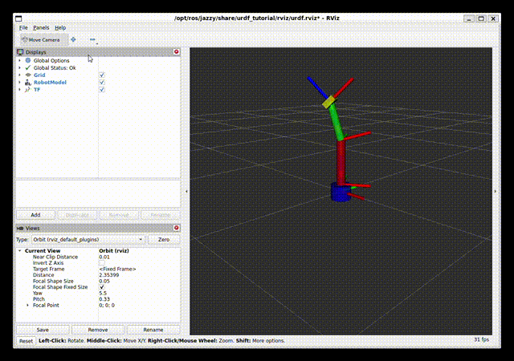
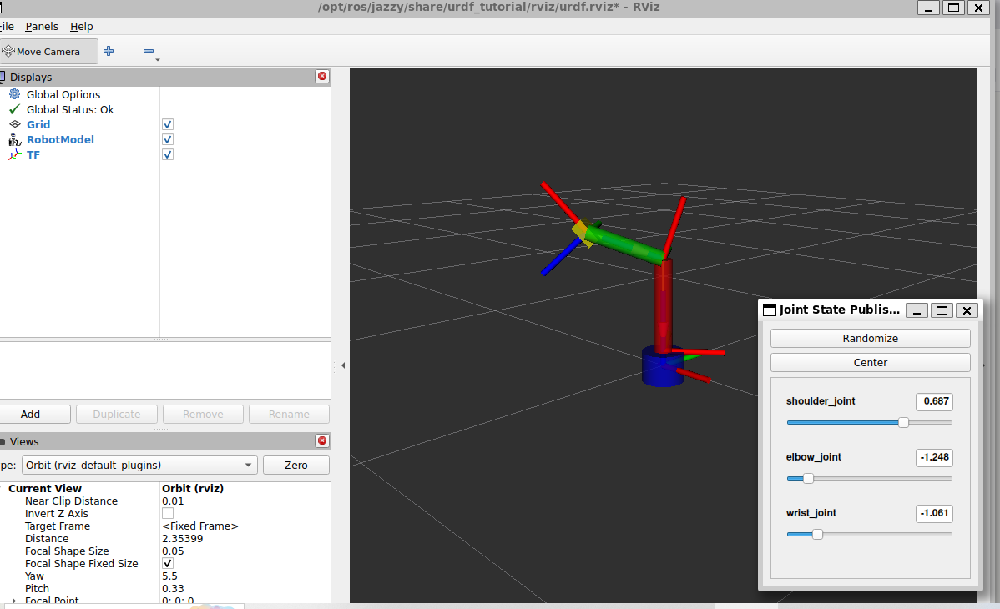

# ROS 2 Learning Journey 🤖

Aspiring mechatronics engineer learning robotics through hands-on projects.

## Robot Arm in Action

## Robot Arm in RViz2

## Sessions
- [Session 01 — WSL2 + ROS 2 Setup](README_01_WSL2_ROS2_Setup.md)
- [Session 02 — Publisher & Subscriber Nodes](README_02_ROS2_Publisher_Subscriber.md)
- [Session 03 — Gazebo, URDF, RViz2 & Joint States](README_03_Gazebo_URDF_RViz2.md)
- [Session 04 — Built a 3-Joint Robotic Arm URDF](README_04_Robotic_Arm_URDF.md)
- [Session 05 — Arm Controller Node + Automated Motion](README_05_Arm_Controller.md)

## Final Goal
Build a pick and place robotic arm simulation using ROS 2 + Gazebo.

## Stack
ROS 2 Jazzy · Ubuntu 24.04 · WSL2 · Python · Gazebo · RViz2 · URDF
